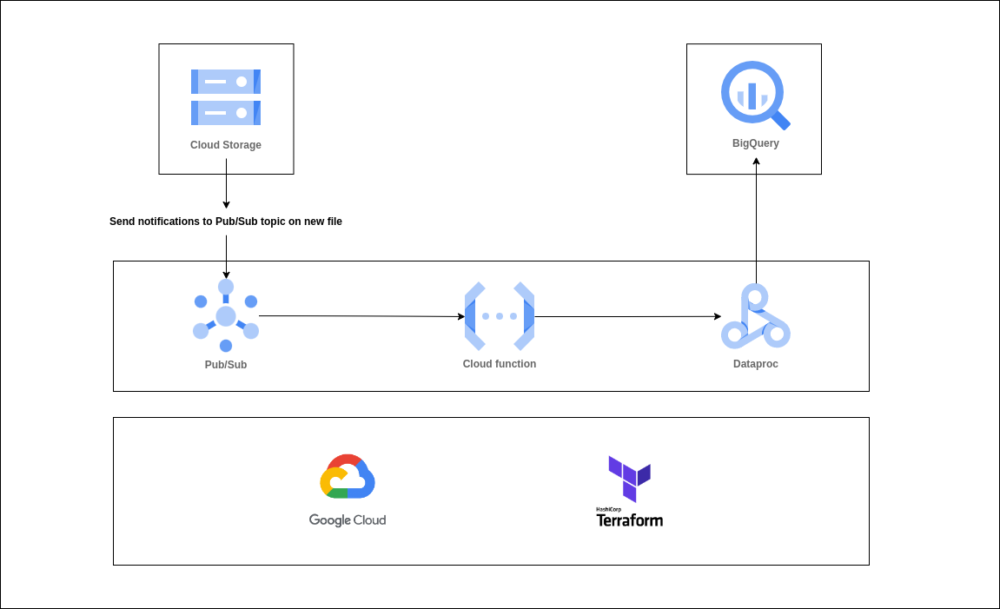
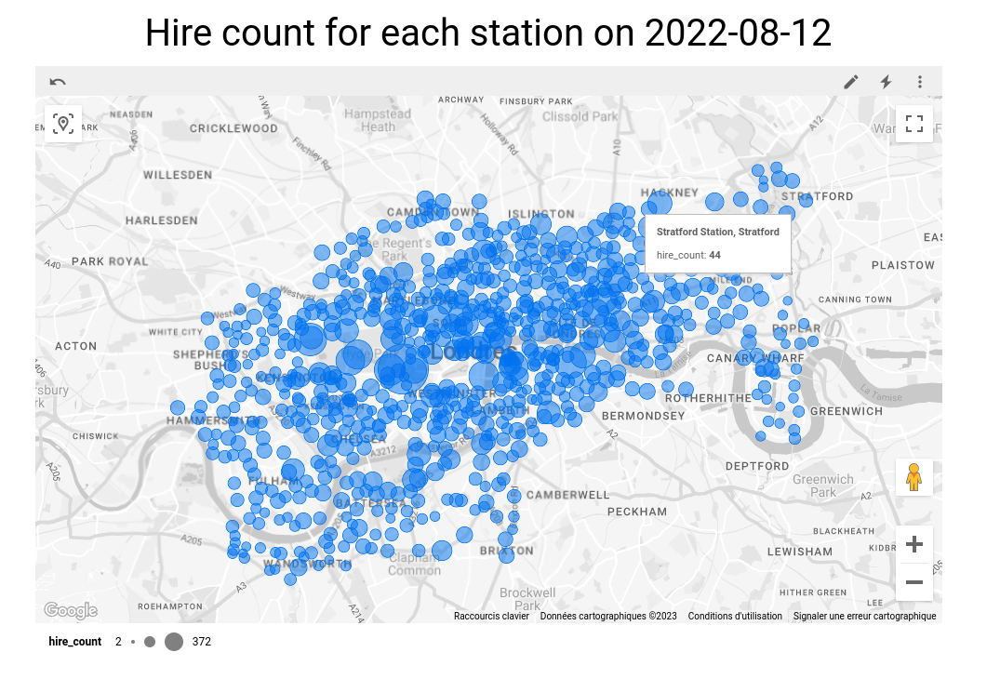

### Tools & Technologies

- Cloud - [**Google Cloud Platform**](https://cloud.google.com)
- Infrastructure as Code software - [**Terraform**](https://www.terraform.io)
- Data Lake - [**Google Cloud Storage**](https://cloud.google.com/storage)
- Message queue - [**Pub/Sub**](https://cloud.google.com/pubsub)
- Cloud compute - [**Cloud Function**](https://cloud.google.com/functions)
- Data Transformation - [**Dataproc**](https://cloud.google.com/dataproc)
- Data Warehouse - [**BigQuery**](https://cloud.google.com/bigquery)
- Data Visualization - [**Looker Studio**](https://cloud.google.com/looker-studio)
- Language - [**Python**](https://www.python.org)

### Data
The data come from the [**Transport for London API**](https://tfl.gov.uk/info-for/open-data-users/our-open-data). You can find some csv files for for the cycle hires [**here**](https://cycling.data.tfl.gov.uk/). The purpose of this project is to automate the ingestion of csv files and perform an etl pipeline within the google cloud environnement.

### Architecture


### Prerequisites
1. Install [**Python**](https://www.python.org/downloads/source/)

2. Install the [**Google Cloud CLI**](https://cloud.google.com/sdk/docs/install-sdk) and log with your google cloud account, select the google cloud project that you'll use to test it.

3. Install [**Terraform**](https://developer.hashicorp.com/terraform/downloads)

4. Create a google cloud project. Export your service account credentials keys. Enable Dataproc API, Pub/Sub API and Cloud function API.

### Installation

Clone the project:
```sh
git clone https://github.com/philippedebeaumont/spark-etl-on-gcp.git
cd spark-etl-on-gcp
```

Launch the cloud infrastructure with terraform. You'll have to provide the path to the google cloud credentials for your project and the google cloud project id.
```sh
cd terraform
terraform init
terraform apply
```

You have to first upload data for the london cycle stations to get the geographic data. Don't forget to change YOU_PROJECT_ID with your own project id.
```sh
gsutil cp gs://london-bikes/london_cycle_stations.csv gs://datalake-YOUR_PROJECT_ID/london_cycle_stations.csv
```

You'll have to upload the weather data.
```sh
gsutil cp gs://london-bikes/2019-2022_london_weather.csv gs://datalake-YOUR_PROJECT_ID/2019-2022_london_weather.csv
```

Then you can upload a file in the hires/ folder to trigger the pipeline.
```sh
gsutil cp gs://london-bikes/hires/298JourneyDataExtract29Dec2021-04Jan2022.csv gs://datalake-YOUR_PROJECT_ID/hires/298JourneyDataExtract29Dec2021-04Jan2022.csv
```

In gs://london-bikes/hires/ you'll find different files with hires data to test the project. To use all the files:
```sh
gsutil -m cp -r gs://london-bikes/hires/ gs://datalake-YOUR_PROJECT_ID/hires/
```

Wait a bit for the pipeline to proc and you'll see data added to your tables for the hires and the daily aggregation for the files provided.

Here is an example of a vizualisation for the daily aggregation:



### Uninstallation
You have to destroy your cloud architecture with terraform to avoid unecessary billings. You'll have to provide the same informations that you entered when you created it.
```sh
terraform destroy
```

You can also suppress your google cloud project.
